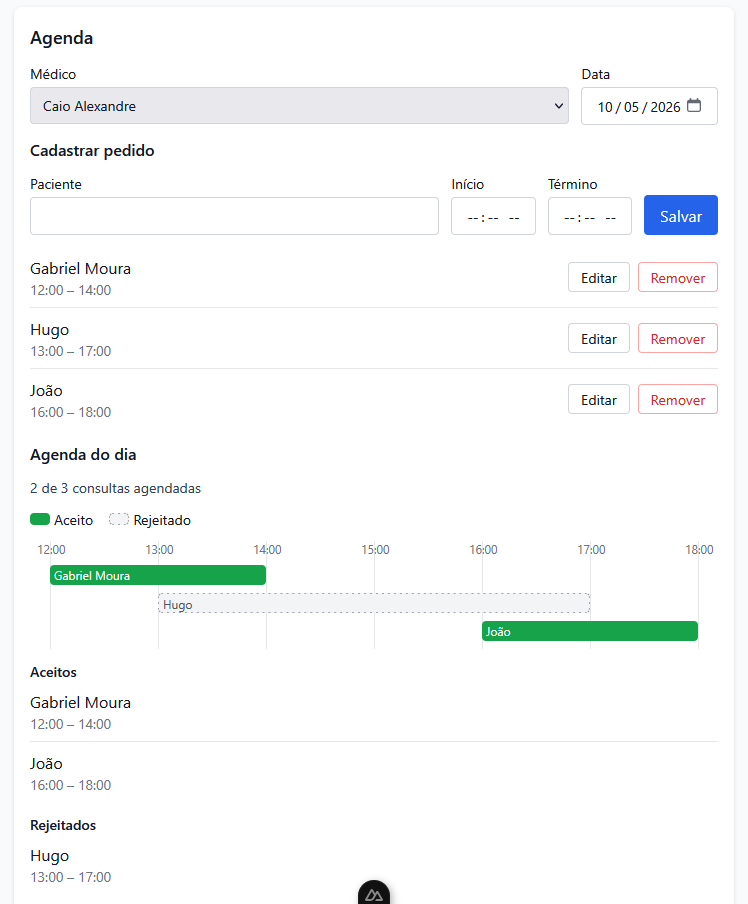

# Otimize

## Integrantes

| Nome                              | Matrícula  |
|------------------------------------|------------|
| Mateus Vieira Rocha da Silva       | 221008703  |
| Caio Alexandre Ornelas Silva       | 221007644  |

## Disciplina

**Projeto de Algoritmos** — Turma T1, 2026.2

Universidade de Brasília (UnB) | Faculdade de Ciências e Tecnologias em Engenharia (FCTE)

Professor: Mauricio Serrano

## Sobre o projeto

O **Otimize** é uma aplicação web (front-end) desenvolvida como trabalho da disciplina de Projeto de Algoritmos, com o objetivo de aplicar conceitos de algoritmos gulosos na prática.

A aplicação funciona como um organizador de clínica médica: o usuário cadastra médicos, seleciona um médico e uma data e registra os pedidos de consulta do dia (paciente, horário de início e horário de término). A partir desses pedidos, o sistema monta a agenda do médico com o **maior número possível de consultas sem sobreposição**, utilizando o algoritmo guloso de **Interval Scheduling**, e exibe o resultado separando os pedidos aceitos dos rejeitados, junto de uma timeline visual do dia.

## Foto de Exemplo



## Vídeo

[Vídeo de demonstração](https://youtu.be/0KKdbj03G-k)

## Algoritmo de agendamento

O agendamento usa o algoritmo guloso de *Interval Scheduling*, que seleciona sempre o pedido que **termina mais cedo**:

1. Os horários são convertidos para minutos desde 00:00.
2. Os pedidos são ordenados pelo horário de término.
3. Os pedidos são percorridos em ordem; cada pedido cujo início seja maior ou igual ao término da última consulta aceita é aceito, e os demais são rejeitados.

As consultas são tratadas como intervalos semiabertos `[início, fim)`, então uma consulta pode começar exatamente no horário em que a anterior termina.

| Etapa                 | Complexidade |
|-----------------------|--------------|
| Ordenação por término | O(n log n)   |
| Varredura linear      | O(n)         |
| **Total**             | **O(n log n)** |

Escolher a consulta que termina primeiro deixa o maior tempo livre possível para as seguintes, o que garante que a agenda obtida tenha o número máximo de consultas compatíveis.

## Tecnologias

- [Nuxt.js](https://nuxt.com/) (Vue.js)
- [TypeScript](https://www.typescriptlang.org/)
- [Tailwind CSS](https://tailwindcss.com/)
- [Node.js](https://nodejs.org/en) (**v22 LTS**)

## Como rodar o projeto

```bash
# instalar dependências
npm install

# rodar em modo de desenvolvimento (http://localhost:3000)
npm run dev
```
